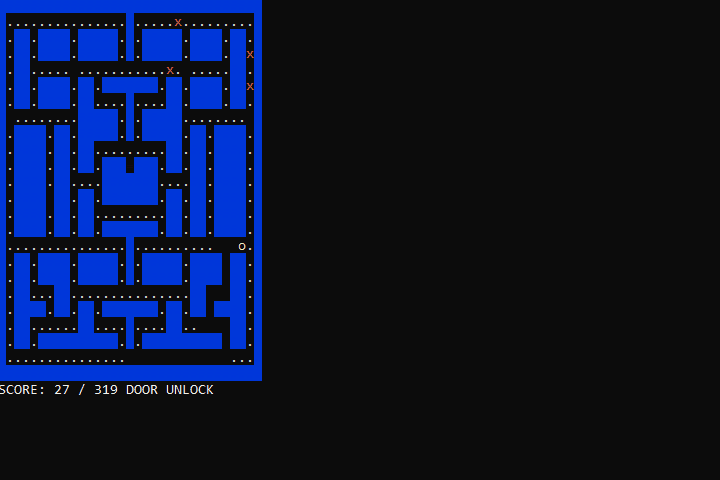
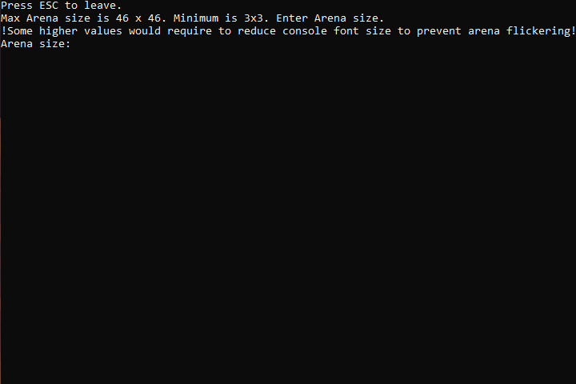
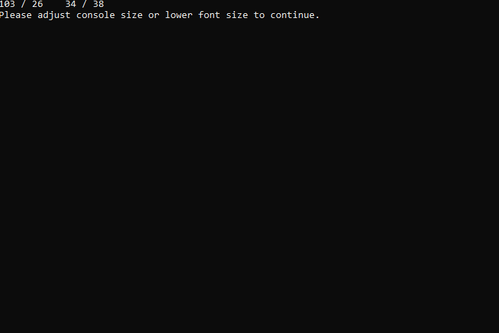

# About
## Created by Bartosz Sorek
***"Pacmogus"*** is Windows console game created in pure C++ with standard library. It's the project created when learning basics of C++. Game is based on Pacman.
### Rules
- Collect all gems to unlock door, enter the door to win
- Avoid enemies (x markers)
### Features
- **Pure C++** without any additional libraries, no need to install anything else.
- **Level editor** to create own level that can be later played in the game. There are basic checks for level structure that alerts the creator if level is incorrectly built.
- **Up to 4 enemies** that can eliminate the player.
- **Difficulty settings** - possibility to change enemies' speed and vision. In easiest difficulty enemies always pick random paths. Harder difficulty makes the enemies follow the player on sight and on the hardest difficulty enemies will remember player's last location.
- **Screen size detection system** - code makes sure that there is enough space to fully display the game area and informs the users how to adjust the size.
- **No flashing** - game runs smoothly without flashing, it's not using system.cls to refresh.
- **Pause system and convenient menu** - navigate in menu using WASD.
- **Multiple levels to play** including custom level.
### Controls
- WASD to move
- Level Editor controls are described in Level Editor itself.
### Media
- **Gameplay**
  

- **Level editor**
  

- **Size change detection**
  

